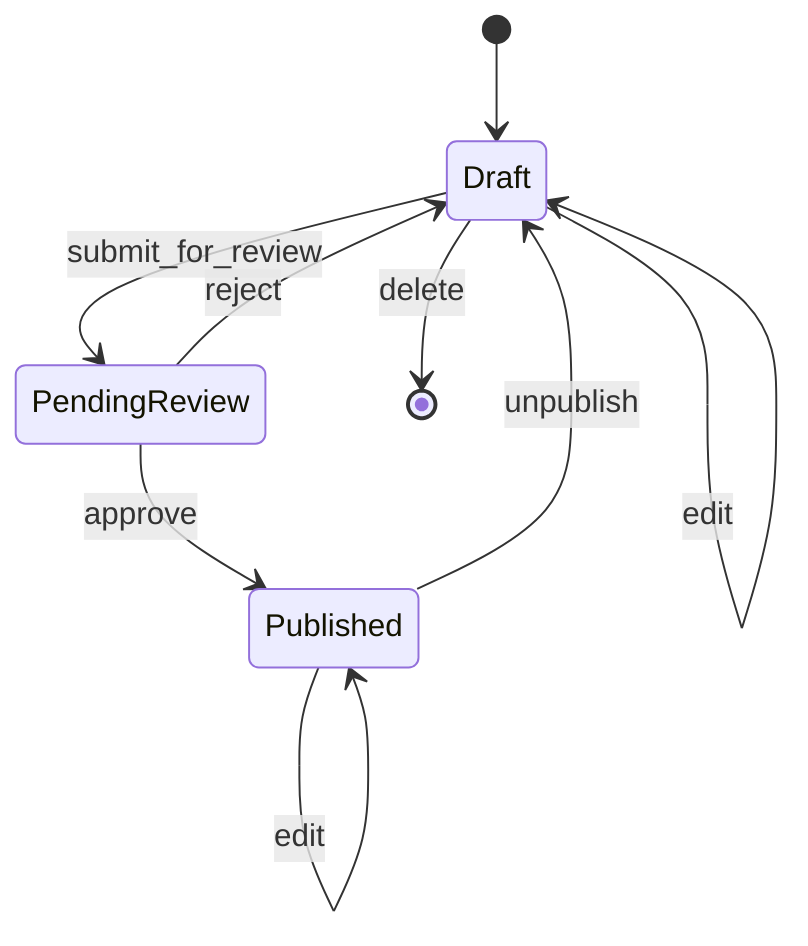

# VRC6 Article Publication Workflow

## Overview
Three-state workflow: Draft → Pending Review → Published

## State Machine Diagram


## States

### Draft
- **Description**: Article is being written by editor
- **Who can view**: Article author, Admins
- **Who can edit**: Article author, Admins  
- **Who can delete**: Article author, Admins
- **Automatic**: All new articles start here
- **Database**: All new articles gets recorded with `created_at` timestamp

### Pending Review
- **Description**: Article submitted for admin approval
- **Who can view**: Article author, Admins
- **Who can edit**: Admins only
- **Who can delete**: Admins only
- **Notifications**: Admins notified when article enters this state

### Published
- **Description**: Article is live on public site
- **Who can view**: Everyone (public)
- **Who can edit**: Admins only
- **Who can delete**: Admins only
- **SEO**: Indexed by search engines

## Transitions

### submit_for_review
- **From**: Draft
- **To**: Pending Review
- **Who**: Article author (Editor)
- **Validations**:
  - Article must have title
  - Article must have body content
  - Article must have featured image
  - Article must have category
- **Side Effects**:
  - Send email to all admins
  - Create audit log entry
  - Set `updated_at` timestamp

### approve
- **From**: Pending Review
- **To**: Published
- **Who**: Admin
- **Side Effects**:
  - Set `published_at` timestamp to now
  - Send email to article author
  - Create audit log entry
  - Clear page cache

### reject
- **From**: Pending Review
- **To**: Draft
- **Who**: Admin
- **Required Input**: Rejection reason (text)
- **Side Effects**:
  - Send email to author with rejection reason
  - Create audit log entry
  - Set `updated_at` timestamp

### unpublish
- **From**: Published
- **To**: Draft
- **Who**: Admin
- **Optional Input**: Reason for unpublishing
- **Side Effects**:
  - Clear `published_at` timestamp
  - Send email to article author
  - Create audit log entry
  - Clear page cache
  - Remove from search index

### edit
- **From**: Draft, Pending Review, or Published
- **To**: Same state
- **Who**: 
  - Draft: Article author, Admin
  - Pending Review: Admin only
  - Published: Admin only
- **Side Effects**:
  - Update `updated_at` timestamp
  - Create audit log entry
  - If Published: clear page cache

### delete
- **From**: Draft only
- **To**: Deleted (hard delete)
- **Who**: Article author, Admin
- **Side Effects**:
  - Remove article from database
  - Create audit log entry

## Permission Matrix

| State | View | Edit | Delete | Submit | Approve | Reject | Unpublish |
|-------|------|------|--------|--------|---------|--------|-----------|
| Draft | Author, Admin | Author, Admin | Author, Admin | Author | - | - | - |
| Pending | Author, Admin | Admin | Admin | - | Admin | Admin | - |
| Published | Public | Admin | Admin | - | - | - | Admin |

## Business Rules

1. **Editor Restrictions**:
   - Can only edit their own articles in Draft state
   - Cannot edit after submitting for review
   - Cannot see other editors' drafts
   - Cannot delete published articles

2. **Admin Powers**:
   - Can view all articles in any state
   - Can edit articles in any state
   - Can delete articles in any state
   - Final approval authority

3. **Audit Trail**:
   - All state changes must be logged
   - Must track: who, when, from_state, to_state, reason (if applicable)

4. **Notifications**:
   - Editors notified when their article is approved/rejected
   - Admins notified when article submitted for review
   - Optional: Slack integration for real-time notifications

## Database Fields Required
```python
status = models.CharField(
    choices=[
        ('draft', 'Draft'),
        ('pending_review', 'Pending Review'),
        ('published', 'Published'),
    ],
    default='draft'
)
created_at = models.DateTimeField(null=True, blank=True)
published_at = models.DateTimeField(null=True, blank=True)
updated_at = models.DateTimeField(null=True, blank=True)
rejection_reason = models.TextField(blank=True)
```

## Future Enhancements

- **Scheduled Publishing**: Allow setting `publish_at` for future date
- **Version History**: Track all edits with full content snapshots
- **Multiple Reviewers**: Require 2 admin approvals before publishing
- **Editor Tiers**: Senior editors can approve junior editor articles
```

## How to Use This with Claude

When you want Claude to implement the workflow:

**Prompt example:**
```
Here's my article workflow specification: [paste the markdown above]

Please create:
1. Django model with status field and methods
2. Wagtail workflow integration
3. Permission classes
4. State transition methods with validation
5. Unit tests for all transitions