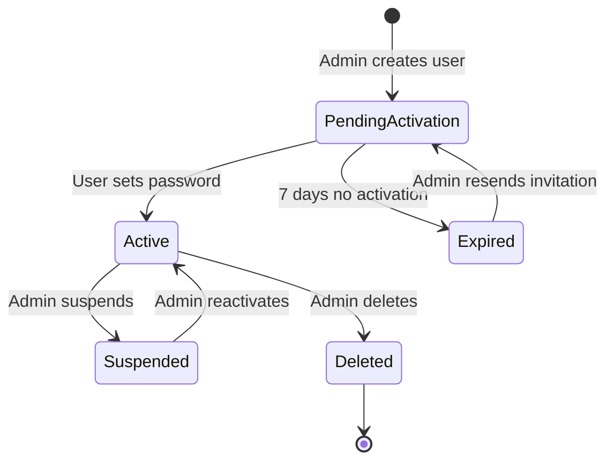
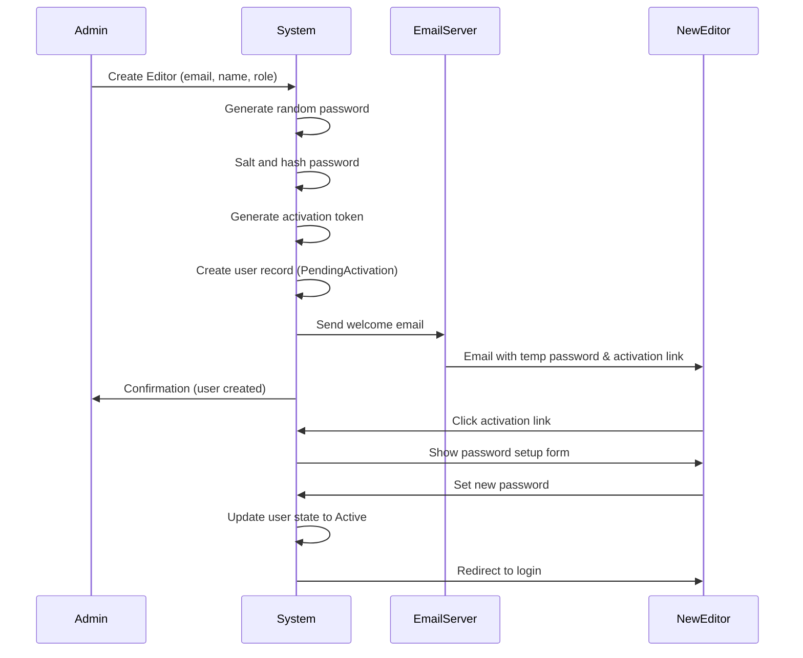

# VRC6 User Management Workflow

## Overview
User creation and modification workflow for VRC6 CMS with role-based access control (Editor and Admin roles).

## User Roles

### Editor
- **Purpose**: Content creators who write and manage their own articles
- **Permissions**:
  - Create articles (starts in Draft state)
  - Edit own articles (only in Draft state)
  - Delete own articles (only in Draft state)
  - Submit articles for review
  - View own articles in any state
  - Cannot see other editors' drafts
  - Cannot approve/publish articles
- **Creation**: Can only be created by Admins
- **Modification**: Can change own password, profile info

### Admin
- **Purpose**: Site administrators with full control
- **Permissions**:
  - All Editor permissions
  - View all articles in any state
  - Edit any article in any state
  - Delete any article in any state
  - Approve/reject articles
  - Publish/unpublish articles
  - Create Editors
  - Create other Admins
  - Modify/delete any user account
  - Manage site settings
- **Creation**: Can only be created by existing Admins
- **Modification**: Can modify any user account

## State Machine Diagram



## User States

### Pending Activation
- **Description**: User account created, awaiting first login and password setup
- **Duration**: 7 days (configurable)
- **Access**: Cannot log in
- **Automatic**: All new user accounts start here
- **Contains**:
  - Temporary default password (auto-generated, salted)
  - Activation token (for password reset link)
  - Invitation email sent

### Active
- **Description**: User has activated account and can access the system
- **Access**: Full access based on role (Editor or Admin)
- **Login**: Can log in with credentials
- **Sessions**: Can have multiple active sessions

### Suspended
- **Description**: Admin has temporarily disabled the account
- **Access**: Cannot log in
- **Data**: All user data preserved
- **Use Case**: Temporary removal without deleting content

### Expired
- **Description**: Activation link expired (7 days passed without activation)
- **Access**: Cannot log in
- **Recovery**: Admin can resend activation email

### Deleted
- **Description**: Soft-deleted account
- **Access**: Cannot log in
- **Data**: User record kept for audit purposes
- **Articles**: Articles preserved but marked as "Former Editor"

## User Creation Workflow

### Create Editor Flow



### Create Admin Flow
(Same as Editor, but with Admin role assigned)

## Transitions

### create_user
- **From**: N/A (new user)
- **To**: PendingActivation
- **Who**: Admin only
- **Required Input**:
  - Email address (must be unique)
  - Full name
  - Role (Editor or Admin)
- **Optional Input**:
  - Profile bio
  - Profile photo
- **Validations**:
  - Email format is valid
  - Email not already in use
  - Role is valid (editor or admin)
- **Side Effects**:
  - Generate secure random password (16 chars: letters, numbers, symbols)
  - Salt and hash password using Django's default (PBKDF2-SHA256)
  - Generate activation token (UUID4)
  - Set `created_at` timestamp
  - Set `activation_expires_at` (7 days from now)
  - Send welcome email via SMTP
  - Create audit log entry
- **Email Content**:
  ```
  Subject: Welcome to VRC6 Magazine
  
  Hi [Name],
  
  An administrator has created an account for you on VRC6.
  
  Your temporary credentials:
  Email: [email]
  Temporary Password: [password]
  
  Please activate your account and set a new password:
  [activation_link]
  
  This link expires in 7 days.
  
  Role: [Editor/Admin]
  
  Welcome to the team!
  ```

### activate_account
- **From**: PendingActivation
- **To**: Active
- **Who**: The user themselves (via activation link)
- **Required Input**:
  - Activation token (from URL)
  - New password (min 12 chars)
  - Password confirmation
- **Validations**:
  - Token is valid and not expired
  - Password meets requirements (min 12 chars, 1 upper, 1 lower, 1 number)
  - Passwords match
- **Side Effects**:
  - Hash and salt new password
  - Clear activation token
  - Set `activated_at` timestamp
  - Clear `activation_expires_at`
  - Create audit log entry
  - Send confirmation email (optional)

### resend_activation
- **From**: Expired
- **To**: PendingActivation
- **Who**: Admin
- **Side Effects**:
  - Generate new activation token
  - Set new `activation_expires_at` (7 days from now)
  - Send new welcome email
  - Create audit log entry

### suspend_user
- **From**: Active
- **To**: Suspended
- **Who**: Admin (cannot suspend themselves)
- **Required Input**: Suspension reason
- **Side Effects**:
  - Set `suspended_at` timestamp
  - Store suspension reason
  - Log out all active sessions
  - Send notification email to user
  - Create audit log entry
  - Notify user's articles are not affected

### reactivate_user
- **From**: Suspended
- **To**: Active
- **Who**: Admin
- **Side Effects**:
  - Clear `suspended_at` timestamp
  - Clear suspension reason
  - Send notification email to user
  - Create audit log entry

### delete_user
- **From**: Active or Suspended
- **To**: Deleted
- **Who**: Admin (cannot delete themselves)
- **Required Input**: Confirmation checkbox
- **Validations**:
  - Confirm admin is not deleting themselves
- **Side Effects**:
  - Set `deleted_at` timestamp
  - Preserve all user data (soft delete)
  - Mark user's articles with "Former Editor" designation
  - Log out all active sessions
  - Create audit log entry
  - Do NOT send email (user is removed)

### expire_activation
- **From**: PendingActivation
- **To**: Expired
- **Who**: System (automated cron job)
- **Trigger**: 7 days after `activation_expires_at`
- **Side Effects**:
  - Set `expired_at` timestamp
  - Clear activation token (security)
  - Create audit log entry
  - Do NOT send email

## User Modification Workflow

### Change Own Password
- **Who**: Any active user (Editor or Admin)
- **Required Input**:
  - Current password
  - New password
  - Password confirmation
- **Validations**:
  - Current password is correct
  - New password meets requirements
  - Passwords match
  - New password different from current
- **Side Effects**:
  - Hash and salt new password
  - Set `password_changed_at` timestamp
  - Log out all other sessions (security)
  - Create audit log entry
  - Send confirmation email

### Change User Role
- **Who**: Admin only
- **Required Input**:
  - User ID
  - New role (Editor or Admin)
- **Validations**:
  - Admin cannot demote themselves
  - At least one admin must remain in system
- **Side Effects**:
  - Update role field
  - Create audit log entry
  - Send notification email to affected user

### Update User Profile
- **Who**: 
  - User can update own profile
  - Admin can update any profile
- **Modifiable Fields**:
  - Full name
  - Bio
  - Profile photo
  - Email (with re-verification)
- **Side Effects**:
  - Update `updated_at` timestamp
  - If email changed: send verification to new email
  - Create audit log entry

### Reset Password (Forgotten)
- **Trigger**: User clicks "Forgot Password"
- **Flow**:
  1. User enters email
  2. System sends password reset link (if email exists)
  3. User clicks link
  4. User sets new password
  5. System updates password
- **Security**: Always show "If email exists, link sent" (no user enumeration)

## Permission Matrix

| Action | Self (Editor) | Other Editor | Self (Admin) | Other User | System |
|--------|---------------|--------------|--------------|------------|--------|
| Create User | ❌ | ❌ | ❌ | ✅ | ❌ |
| View Profile | ✅ | ❌ | ✅ | ✅ | ❌ |
| Edit Profile | ✅ | ❌ | ✅ | ✅ | ❌ |
| Change Own Password | ✅ | ❌ | ✅ | ❌ | ❌ |
| Reset Password | ❌ | ❌ | ❌ | ✅ | ❌ |
| Change Role | ❌ | ❌ | ❌ | ✅ | ❌ |
| Suspend User | ❌ | ❌ | ❌ | ✅ | ❌ |
| Reactivate User | ❌ | ❌ | ❌ | ✅ | ❌ |
| Delete User | ❌ | ❌ | ❌ | ✅ | ❌ |
| Expire Activation | ❌ | ❌ | ❌ | ❌ | ✅ |

## Security Requirements

### Password Hashing
- **Algorithm**: Django default (PBKDF2-SHA256)
- **Iterations**: 600,000+ (Django 5.x default)
- **Salt**: Automatic per-password (handled by Django)
- **Storage**: Never store plaintext passwords
- **Temp Passwords**: Also hashed, never sent in plain text after initial email

### Password Requirements
- **Minimum Length**: 12 characters
- **Complexity**:
  - At least 1 uppercase letter
  - At least 1 lowercase letter
  - At least 1 number
  - At least 1 special character (optional but recommended)
- **Cannot Contain**:
  - User's email
  - User's name
  - Common passwords (Django's password validation)

### Session Security
- **Session Timeout**: 2 weeks (configurable)
- **HTTPS Only**: All authentication over HTTPS
- **CSRF Protection**: Django's built-in CSRF middleware
- **Session on Password Change**: Logout other sessions

### Email Security
- **Activation Tokens**: UUID4 (random, non-guessable)
- **Token Expiry**: 7 days
- **Single Use**: Token invalidated after use
- **Rate Limiting**: Max 5 activation emails per hour per user

## Database Fields Required

```python
# Custom User Model extending Django's AbstractBaseUser

class User(AbstractBaseUser, PermissionsMixin):
    # Core fields
    email = models.EmailField(unique=True)
    full_name = models.CharField(max_length=200)
    role = models.CharField(
        max_length=20,
        choices=[
            ('editor', 'Editor'),
            ('admin', 'Admin'),
        ]
    )
    
    # Profile fields
    bio = models.TextField(blank=True)
    profile_photo = models.ForeignKey(
        'wagtailimages.Image',
        null=True,
        blank=True,
        on_delete=models.SET_NULL
    )
    
    # State fields
    status = models.CharField(
        max_length=20,
        choices=[
            ('pending_activation', 'Pending Activation'),
            ('active', 'Active'),
            ('suspended', 'Suspended'),
            ('expired', 'Expired'),
            ('deleted', 'Deleted'),
        ],
        default='pending_activation'
    )
    
    # Activation fields
    activation_token = models.UUIDField(null=True, blank=True)
    activation_expires_at = models.DateTimeField(null=True, blank=True)
    activated_at = models.DateTimeField(null=True, blank=True)
    
    # Suspension fields
    suspended_at = models.DateTimeField(null=True, blank=True)
    suspension_reason = models.TextField(blank=True)
    
    # Timestamps
    created_at = models.DateTimeField(auto_now_add=True)
    updated_at = models.DateTimeField(auto_now=True)
    password_changed_at = models.DateTimeField(null=True, blank=True)
    last_login = models.DateTimeField(null=True, blank=True)
    deleted_at = models.DateTimeField(null=True, blank=True)
    expired_at = models.DateTimeField(null=True, blank=True)
    
    # Django required fields
    is_staff = models.BooleanField(default=False)  # For Django admin
    is_active = models.BooleanField(default=True)  # For Django auth
    
    USERNAME_FIELD = 'email'
    REQUIRED_FIELDS = ['full_name']
```

## Email Server Configuration

```python
# settings.py

# Use your personal email server
EMAIL_BACKEND = 'django.core.mail.backends.smtp.EmailBackend'
EMAIL_HOST = 'mail.yourdomain.com'  # Your email server
EMAIL_PORT = 587  # or 465 for SSL
EMAIL_USE_TLS = True  # or EMAIL_USE_SSL = True
EMAIL_HOST_USER = 'noreply@vrc6.com'
EMAIL_HOST_PASSWORD = 'your-smtp-password'
DEFAULT_FROM_EMAIL = 'VRC6 Magazine <noreply@vrc6.com>'

# Email settings
ACCOUNT_ACTIVATION_DAYS = 7
PASSWORD_RESET_TIMEOUT = 86400  # 24 hours in seconds
```

## Email Templates Needed

### 1. Welcome Email (User Creation)
- **Template**: `emails/welcome.html` and `emails/welcome.txt`
- **Variables**: `{name, email, temp_password, activation_link, role, expires_days}`

### 2. Activation Confirmation
- **Template**: `emails/activation_confirmed.html`
- **Variables**: `{name, login_url}`

### 3. Password Changed
- **Template**: `emails/password_changed.html`
- **Variables**: `{name, changed_at, ip_address}`

### 4. User Suspended
- **Template**: `emails/account_suspended.html`
- **Variables**: `{name, reason, suspended_by, contact_email}`

### 5. User Reactivated
- **Template**: `emails/account_reactivated.html`
- **Variables**: `{name, login_url}`

### 6. Role Changed
- **Template**: `emails/role_changed.html`
- **Variables**: `{name, old_role, new_role, changed_by}`

### 7. Password Reset
- **Template**: `emails/password_reset.html`
- **Variables**: `{name, reset_link, expires_hours}`

## Audit Logging

All user management actions must be logged:

```python
class UserAuditLog(models.Model):
    user = models.ForeignKey(User, on_delete=models.CASCADE)
    action = models.CharField(max_length=50)  # 'created', 'activated', 'suspended', etc.
    performed_by = models.ForeignKey(
        User,
        on_delete=models.SET_NULL,
        null=True,
        related_name='audit_actions_performed'
    )
    details = models.JSONField()  # Additional context
    ip_address = models.GenericIPAddressField(null=True)
    timestamp = models.DateTimeField(auto_now_add=True)
```

**Logged Actions**:
- User created
- User activated
- Password changed
- Role changed
- User suspended
- User reactivated
- User deleted
- Failed login attempts
- Activation expired

## Automated Tasks (Cron Jobs)

### Expire Old Activations
- **Frequency**: Daily at 2 AM
- **Action**: Move users from PendingActivation to Expired if 7 days passed
- **Implementation**: Django management command + cron

```python
# management/commands/expire_activations.py
from django.core.management.base import BaseCommand
from django.utils import timezone
from users.models import User

class Command(BaseCommand):
    def handle(self, *args, **options):
        expired_users = User.objects.filter(
            status='pending_activation',
            activation_expires_at__lt=timezone.now()
        )
        count = expired_users.update(
            status='expired',
            expired_at=timezone.now()
        )
        self.stdout.write(f'Expired {count} activations')
```

### Clean Up Old Deleted Users (Optional)
- **Frequency**: Monthly
- **Action**: Permanently delete users deleted >1 year ago
- **Security**: Keep audit logs even after hard deletion

## Business Rules

1. **Admin Safeguards**:
   - At least one admin must exist in the system
   - Admins cannot suspend/delete themselves
   - Admins cannot demote themselves to Editor

2. **Email Uniqueness**:
   - Email addresses must be unique across all users (active, suspended, deleted)
   - Use email as username (USERNAME_FIELD = 'email')

3. **Activation Expiry**:
   - Default: 7 days (configurable)
   - Admins can resend activation for expired accounts
   - Temp password is invalidated on expiry

4. **Password Policy**:
   - Enforce on user creation (temp password generation)
   - Enforce on activation
   - Enforce on password change
   - Enforce on password reset

5. **Session Management**:
   - Password change logs out all other sessions
   - Suspension immediately invalidates all sessions
   - Deletion immediately invalidates all sessions

6. **Rate Limiting**:
   - Max 5 failed login attempts per 15 minutes
   - Max 3 password reset requests per hour
   - Max 5 activation email resends per day

## Testing Requirements

### Unit Tests
- Password hashing and verification
- Token generation (randomness, uniqueness)
- Email validation
- Role permission checks
- State transition validation

### Integration Tests
- User creation flow (admin creates editor)
- Activation flow (email → click → set password)
- Password change flow
- Suspension/reactivation flow
- Role change with permission updates

### E2E Tests
- Complete user lifecycle (create → activate → login → change password → suspend → reactivate)
- Admin cannot suspend self
- Email delivery verification (use email test server)
- Activation link expiry

### Security Tests
- Password strength enforcement
- CSRF protection on forms
- Session fixation prevention
- Token uniqueness and randomness
- Rate limiting on sensitive actions

## Future Enhancements

- **Two-Factor Authentication (2FA)**: TOTP or SMS-based
- **OAuth/Social Login**: Google, GitHub integration
- **Password Rotation Policy**: Require password change every 90 days
- **Login History**: Track all login attempts with IP, device, location
- **API Keys**: For programmatic access
- **Granular Permissions**: Beyond Editor/Admin (e.g., Senior Editor, Contributor)
- **User Groups/Teams**: Organize editors into teams with shared access
- **Impersonation**: Allow admins to view site as another user (audit trail)

## Implementation Checklist

- [ ] Create custom User model
- [ ] Set up email backend (SMTP to personal server)
- [ ] Create email templates (welcome, activation, etc.)
- [ ] Implement user creation view (admin only)
- [ ] Implement activation view (token-based)
- [ ] Implement password change view
- [ ] Implement password reset flow
- [ ] Implement user suspension/reactivation
- [ ] Create audit logging model
- [ ] Set up cron job for expiring activations
- [ ] Write unit tests for all transitions
- [ ] Write integration tests for workflows
- [ ] Set up rate limiting
- [ ] Configure Django authentication backends
- [ ] Create admin interface for user management
- [ ] Test email delivery on Raspberry Pi